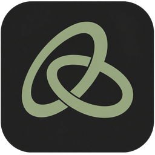

<p align="center"></p>

<h1 align="center">Nanofy</h1>

<p align="center">Cliente nativo de Spotify para escritorio, escrito en Rust.</p>

<p align="center">
  <a href="https://github.com/ElRobaMichis/nanofy/releases/latest"></a>
  <a href="https://github.com/ElRobaMichis/nanofy/actions/workflows/ci.yml"></a>
  <a href="LICENSE"></a>
</p>

<p align="center"><a href="#instalación">Instalar</a> · <a href="#compilar">Compilar</a> · <a href="#privacidad-y-datos">Privacidad</a> · <a href="CONTRIBUTING.md">Contribuir</a></p>

Nanofy reproduce Spotify en una ventana nativa, sin Electron ni webview. Dibuja la interfaz en la
CPU, sin cargar el controlador gráfico, y en reposo no consume procesador. Aparece como un
dispositivo Spotify Connect más, controla tus otros dispositivos y puede crear una Jam o unirse a
una. Funciona en Windows, Linux y macOS, y la interfaz está en español. Para reproducir hace falta
**Spotify Premium**.

## Características

### Reproducción y sonido

- Hasta 320 kbps, normalización de volumen con los tres niveles de Spotify, reproducción sin pausas y fundido de 1 a 12 s.
- Remuestreo sinc cuando la salida no está a 44,1 kHz.
- El audio sigue al dispositivo predeterminado del sistema (auriculares, Bluetooth), también si cambia en pausa.
- Al abrir, recupera la última sesión, en pausa y en el mismo segundo, con la cola y los modos aleatorio y repetición.
- Temporizador de apagado, reproducción automática al terminar una lista y opción de ocultar canciones para que se salten.
- Letras sincronizadas (de Spotify cuando las ofrece y, si no, de LRCLIB); un clic en una línea salta a ese punto.

### Biblioteca y navegación

- Playlists: crear, editar, cambiar la portada, hacerlas colaborativas, organizarlas en carpetas y añadir canciones a varias a la vez.
- Me gusta, álbumes, artistas, podcasts e historial; las listas de canciones tienen selección múltiple y buscador propio.
- Pestañas con historial propio, Inicio personalizable y búsqueda con nueve filtros.
- Pegar en la búsqueda un enlace de `open.spotify.com` o una URI `spotify:` lo abre directamente.

### Control y social

- Se controla desde el móvil como cualquier dispositivo Connect, y el selector «Reproducir en» maneja los demás dispositivos.
- Jam: crear, invitar y unirse con enlace o código.

### Sistema y fiabilidad

- Teclas multimedia y controles de reproducción del sistema, con título y portada, en Windows, Linux y macOS.
- Miniplayer siempre visible y, en Windows, botones de reproducción en la miniatura de la barra de tareas.
- Si se corta la red, se pausa en ese segundo y continúa cuando vuelve la conexión; si algo falla o tarda, avisa y ofrece reintentar.
- Tema claro, oscuro o del sistema.
- <kbd>Ctrl</kbd>+<kbd>/</kbd> (<kbd>Cmd</kbd>+<kbd>/</kbd> en macOS) muestra los atajos de teclado.

## Rendimiento

Medido el 7 de octubre de 2026 con la versión 1.8.0 en un equipo con Windows 11, Intel Core i7 de
16 hilos y RTX 3060 (la GPU no se usa). Memoria, CPU, arranque, cierre y fotogramas son la mediana
de tres repeticiones; los tiempos de reproducción, carga de playlists y búsqueda dependen también de
la red.

| Medida | Valor |
|---|---|
| Memoria en reposo con sesión (conjunto de trabajo / privada) | 14 MB / 26 MB |
| Memoria reproduciendo (conjunto de trabajo / privada) | 22 MB / 55 MB |
| CPU en reposo / reproduciendo (sobre el procesador entero) | 0 % / 0,4 % |
| De crear el proceso a ver la ventana con contenido | 55 ms (66 ms con sesión) |
| Del clic en la X al cierre del proceso | 26 ms (60 ms reproduciendo) |
| De pulsar reproducir a oír la canción | ~0,3 s |
| Abrir una playlist ya vista | < 0,1 s |
| Cargar por primera vez una playlist entera de 9918 canciones | 2,6 s |
| Búsqueda | ~1 s |
| Tiempo por fotograma al desplazar una lista (ventana de 1920×1040) | ~2 ms |
| Tamaño del ejecutable / del zip de Windows | ~17 MB / ~8 MB |

## Instalación

Descarga el zip de tu sistema desde [Releases](https://github.com/ElRobaMichis/nanofy/releases/latest).
No hay instalador.

| Sistema | Archivo |
|---|---|
| Windows 10 u 11, 64 bits | `Nanofy-windows-x64.zip` |
| Linux, x86-64 | `Nanofy-linux-x64.zip` |
| macOS 11 o posterior, Apple Silicon | `Nanofy-macos-arm64.zip` |
| macOS 11 o posterior, Intel | `Nanofy-macos-x64.zip` |

Cada versión incluye `SHA256SUMS.txt` para comprobar la descarga (`sha256sum` en
Linux, `shasum -a 256` en macOS, `Get-FileHash` en Windows).

1. Descomprime el zip en una carpeta en la que tengas permiso de escritura, para que Nanofy se pueda
   actualizar solo. En Windows, por ejemplo, en `%LOCALAPPDATA%\Programs` (el zip ya trae la
   carpeta `Nanofy`), y no en Archivos de programa ni en OneDrive. No ejecutes Nanofy desde dentro
   del zip.
2. Abre Nanofy. En Linux hacen falta ALSA (`libasound2`) y OpenSSL 3; ejecútalo con
   `chmod +x nanofy && ./nanofy`. Los binarios no están firmados, así que Windows y macOS avisan la
   primera vez:
   - Windows: en el aviso «Windows protegió tu PC», pulsa «Más información» y después «Ejecutar de
     todas formas».
   - macOS: intenta abrir `Nanofy.app` y pulsa «Abrir igualmente» en Ajustes del Sistema →
     Privacidad y seguridad (en macOS 14 o anterior también sirve clic derecho → «Abrir»).
3. Pulsa «Iniciar sesión con Spotify» y acepta los permisos en el navegador. El inicio de sesión usa
   OAuth con PKCE: Nanofy no ve tu contraseña y no hace falta crear una app de desarrollador.

### Actualizaciones

Nanofy busca versiones nuevas al arrancar y cada seis horas con una petición anónima a GitHub. En
Windows y Linux descarga la actualización en segundo plano, comprueba su tamaño y su SHA-256 y
muestra «Reiniciar para actualizar»; si la versión nueva no arranca, Nanofy vuelve solo a la
anterior. En macOS solo avisa. Tanto la búsqueda como la instalación automática se pueden
desactivar en Ajustes → Acerca de Nanofy.

## Compilar

Hace falta Rust 1.95 o superior ([rustup](https://rustup.rs)) y, según el sistema:

- **Windows**: Visual Studio Build Tools con las herramientas de C++ y el SDK de Windows (toolchain
  MSVC, la predeterminada).
- **Debian/Ubuntu**: `sudo apt install build-essential pkg-config libasound2-dev libssl-dev libxkbcommon-dev libdbus-1-dev`
- **macOS**: `xcode-select --install`

```sh
git clone https://github.com/ElRobaMichis/nanofy
cd nanofy
cargo build --release
```

El ejecutable queda en `target/release/nanofy` (`nanofy.exe` en Windows); en macOS es un binario
suelto, no un `.app`. Las copias que se ejecutan desde `target/` no se actualizan solas: avisan de
las versiones nuevas con «Instalar». Para compilar en Windows sin permisos de administrador,
consulta [CONTRIBUTING.md](CONTRIBUTING.md#windows-sin-permisos-de-administrador).

## Privacidad y datos

Nanofy no tiene telemetría ni servidores propios y no acepta conexiones de otros equipos. Solo se
conecta a estos servicios:

| Servicio | Para qué | Qué recibe |
|---|---|---|
| Spotify | Sesión, audio, biblioteca, búsqueda, portadas, Spotify Connect, Jam y letras | Lo mismo que recibe de cualquier dispositivo Spotify Connect, incluido lo que suena |
| [LRCLIB](https://lrclib.net) | Letras, solo con el panel abierto y si Spotify no las da | Título, artista, álbum y duración de la canción |
| Deezer, iTunes y MusicBrainz | Géneros de álbumes y artistas | Solo los nombres del artista y del álbum |
| GitHub | Buscar y descargar actualizaciones (desactivable) | La versión instalada, sin cuenta ni token |

Como cualquier servidor, todos estos servicios ven tu dirección IP. El audio y las portadas se
piden a las direcciones que indica Spotify, normalmente las de su CDN.

| Datos | Windows | Linux | macOS |
|---|---|---|---|
| Ajustes | `%APPDATA%\nanofy\config` | `~/.config/nanofy` | `~/Library/Application Support/nanofy` |
| Sesión, credenciales, copia de la biblioteca y `nanofy.log` | `%LOCALAPPDATA%\nanofy\data` | `~/.local/state/nanofy` | `~/Library/Application Support/nanofy` |
| Caché de audio, portadas y listas | `%LOCALAPPDATA%\nanofy\cache` | `~/.cache/nanofy` | `~/Library/Caches/nanofy` |

Las credenciales y los tokens se guardan en JSON sin cifrar, no en el llavero del sistema.
«Cerrar sesión» (Ajustes → Cuenta) borra la sesión guardada, pero no el acceso a la biblioteca, que
se quita con «Desconectar» en Ajustes → Biblioteca.

### Desinstalar

Nanofy no escribe en el registro de Windows ni crea accesos directos. Para desinstalarlo, borra la
carpeta donde lo descomprimiste y las de la tabla (en Windows, `%APPDATA%\nanofy` y
`%LOCALAPPDATA%\nanofy`). Si quieres, revoca también su acceso en la página de aplicaciones de tu
cuenta de Spotify.

## Limitaciones

- Sin Premium no se puede reproducir: solo explorar la biblioteca, buscar y gestionar playlists.
- No hay calidad sin pérdida: el FLAC de Spotify está protegido por DRM. El máximo es 320 kbps.
- La búsqueda, el Inicio, las playlists, las letras y la Jam usan API internas no documentadas que Spotify puede cambiar.
- Las letras de Spotify no están disponibles para todas las cuentas, y LRCLIB no tiene todas las canciones.
- «Descargar» guarda el audio en la caché de disco, pero no es un modo sin conexión: hace falta red para reproducirlo y la caché puede descartarlo cuando se llena.
- No se pueden reordenar canciones arrastrando ni hay icono en la bandeja del sistema.
- Las pruebas automáticas solo se ejecutan en Windows: los zips de Linux y macOS se compilan en cada versión, pero no se prueban.

## Informar de un fallo

Abre un [issue](https://github.com/ElRobaMichis/nanofy/issues) con la versión (Ajustes → Acerca de
Nanofy), el sistema y los pasos para reproducirlo, y adjunta `nanofy.log` y `nanofy.log.1` (la
carpeta aparece en [Privacidad y datos](#privacidad-y-datos)). Revísalos antes de publicarlos:
incluyen tu nombre de usuario de Spotify y pueden incluir títulos de canciones. Más detalles en
[CONTRIBUTING.md](CONTRIBUTING.md#informar-de-un-fallo).

## Créditos y licencia

Nanofy se apoya en [librespot](https://github.com/librespot-org/librespot) (con parches propios en
`vendor/`), [egui](https://github.com/emilk/egui), [winit](https://github.com/rust-windowing/winit),
[softbuffer](https://github.com/rust-windowing/softbuffer), [rodio](https://github.com/RustAudio/rodio),
[Symphonia](https://github.com/pdeljanov/Symphonia) y [souvlaki](https://github.com/Sinono3/souvlaki).
Letras de [LRCLIB](https://lrclib.net); géneros de Deezer, iTunes y MusicBrainz.

Licencia [MIT](LICENSE). Nanofy es un proyecto independiente y no está afiliado a Spotify.
Spotify es una marca de Spotify AB.
